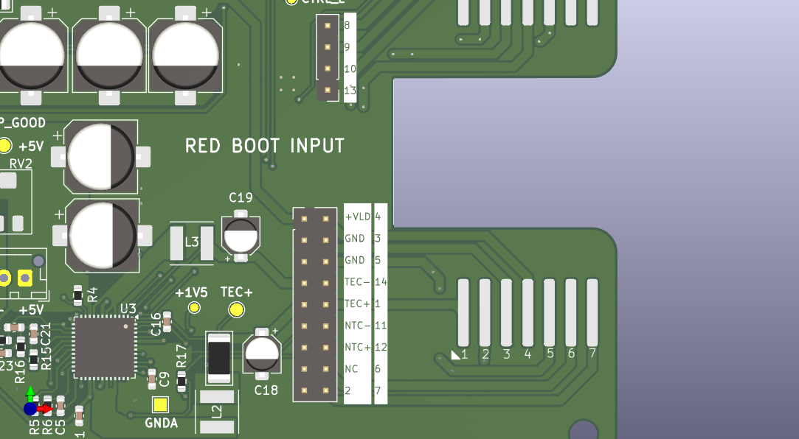
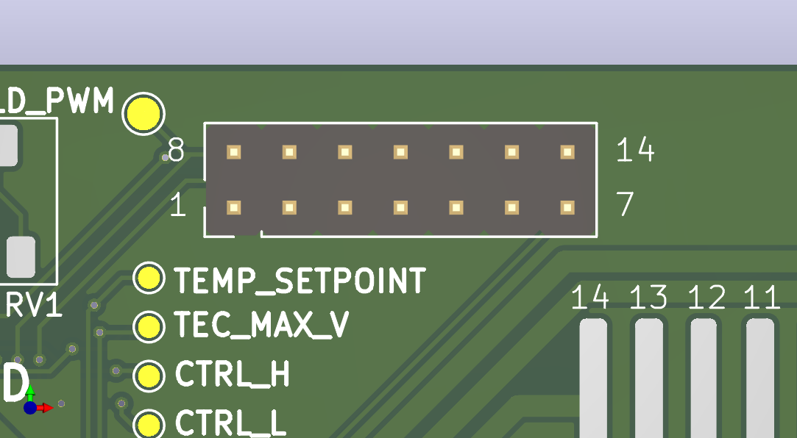

# Overview
This is an experimental slave module used to drive a SOA with a butterfly package and integrated TEC. The driver can be operated from the header connector on the side.
The board was initially thought as a Laser Diode driver encased in butterfly packages, which usually integrate both the LD and a Peltier cell. Since SOAs are packaged in the same way, this board can be used for those as well.
Since there is no standard pinouts in butterfly-type packages, this board routes all its power outputs and inputs to a row of headers, and all butterfly pins are routed to open headers as well, so that it is possible to route different parts of the board to different butterfly pins, whose position is numbered and indicated on silkscreen. 



# Pinout



|PIN|USAGE|INFO|
|-|-|-|
|1|3V3|Logic power supply, mandatory for the DAC that sets the SOA (or LD) voltage|
|2|SCL|I2C clock pin for the DAC|
|3|SDA|I2C data pin for the DAC|
|4|$\overline{LDAC}$|Enable DAC register write mode|
|5|$RDY/\overline{BSY}$|This pin gives information on the DAC status|
|6|GND||
|7|TEC_EN|Enabling input for TEC|
|8|LD_MOD|LT3743's PWM input, when this signal is set to low all switching is disabled. Pull high if you don't plan to use it|
|9|CTRL_SEL|LT3743's switch for output voltage selection. The board has a double output capacitor topology that can be used to switch between two voltages. Useful if there is the need to keep an LD under the lasing threshold and periodically switch to a higher voltage.|
|10|ILD_MON|SOA (or LD) current monitor|
|11|LD_EN|LT3743's enable pin|
|12|UNDRTMP_ALM|Sets if the temperature gets lower than a certain setpoint|
|13|OVRTMP_ALM|Sets if the temperature gets higher than a certain setpoint|
|14|ITEC_MON|TEC current monitor|

# Usage

The board was tested with a Basys3 as a master module and the firmware is available in this repository. If a basys3 is used to operate this driver connect its output pins in the following way (declared in the bays3's constraint file):

JA1     &rarr; OVRTMP_ALM  \
JA2     &rarr; UNDRTMP_ALM \
JA3     &rarr; LD_EN \
JA4     &rarr; CTRL_SEL \
JA5     &rarr; GND \
JA6     &rarr; 3V3 \
JA8     &rarr; TEC_EN \
JA9     &rarr; SDA \
JA10    &rarr; SCL \
JB1     &rarr; $\overline{LDAC}$  
\
To control the board with the Basys3 simply connect these pins and connect the board to the computer via USB. The given firmware will provide a rudimental serial interface that will control the state of the driver.
A simple python script can do the trick. the following one will work on linux:

```
import serial

ser = serial.Serial('/dev/ttyUSB1', baudrate=9600, bytesize=serial.EIGHTBITS, parity=serial.PARITY_NONE, stopbits=serial.STOPBITS_TWO,timeout=10)

while True:
    packet = bytearray(input("Waiting for a command: ").encode("ascii") + b'\n')

    ser.write(packet)

    for i in packet:
        print(ser.read())
    
```

#### Update
Now this repo provides a python script that gives a console to the user to send commands and see current parameters. The requirements for the python script are the following: 

- curses
- threading
- pyserial
- time
- re

### Command list

|COMMAND|INFO|
|-|-|
|OFF|Pulls LD_EN to low, disables all switching functions. Any other command will set LD_EN back to high|
|PWM|Sets PWM mode with a certain duty cycle, set CTLL voltage first to operate the SOA in this mode|
|SET|Sets the selected register of the DAC to a set value|
|DBL|Sets double output voltage mode, the low and high thresholds have to be set first|

The SET command will accept the following attributes:

|ATTRIBUTE|INFO|
|-|-|
|CTLL| Modifies the lower voltage threshold CTRL_L. Note: this pin is internally clamped to 1.5V by the LT3743|
|CTLH| Modifies the higher voltage threshold CTRL_H. Note: this pin is internally clamped to 1.5V by the LT3743|
|TSET| Sets the voltage setpoint for the TEC's PID controller|
|MAXV| Sets the TEC's maximum operating voltage|

### Syntax
<table>
    <tr>
        <th>BASE COMMAND</th>
        <th>FIRST ATTRIBUTE</th>
        <th>SECOND ATTRIBUTE</th>
    </tr>
    <tr>
        <td>OFF</td>
        <td>None</td>
        <td>None</td>
    </tr>
    <tr>
        <td rowspan="4">SET</td>
        <td>CTLL</td>
        <td rowspan="2">Integer from 0 to 1500, which corresponds to a voltage output from the DAC that goes from 0 to 1.5V. This voltage sets the inductor current which charges its corresponding output capacitor.
        </td>
    </tr>
    <tr>
        <td>CTLH</td>
        <td></td>
    </tr>
    <tr>
        <td>TSET</td>
        <td>Integer from 0 to 1500, which corresponds to a voltage output from the DAC that goes from 0 to 1.5V.</td>
    </tr>
    <tr>
        <td>MAXV</td>
        <td>Integer from 0 to 2048, which corresponds to a voltage output from the DAC that goes from 0 to 2.048V.
        Maximum TEC voltage will be set to 4*MAXV</td>
    </tr>
    <tr>
        <td>PWM</td>
        <td>Integer encoded in three ciphers from 000 to 100</td>
        <td>None</td>
    </tr>
    <tr>
        <td>DBL</td>
        <td>None</td>
        <td>None</td>
    </tr>
</table>

#### Update Note
The commands are not case sensitive anymore

### Examples

Turn on a SOA or an LD:

```
SET CTLL XXXX
PWM 100
```

Enable PWM modulation

```
SET CTLL XXXX
PWM XXX
```